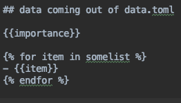

# data processing

## data in markdown doc

data can be included in a markdown document using yaml or toml

the data will be attached to the markdown document and can later be used as following:

## data can also be as a .toml file 

These toml files need to be next to the markdown docs
e.g.

data.toml will be read and made available to each .md in this directory

## data usage

the full jinja2 syntax has been supported

in this case the data comes from data.toml file which was in the directory

