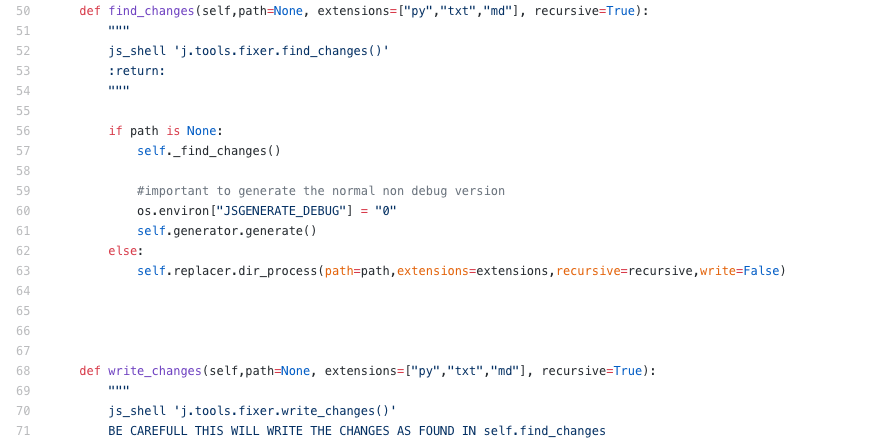

# Include macro


## arguments

```
:param name: name of the document to look for (will always be made lowercase)
:param repo: url of the repo, if url given then will checkout
    the required content from a git repo, the url can be a custom link, with the format of account:repo(branch):/path/to/docs, e.g. `threefoldfoundation:info_tokens(development):/docs`
    see docs/tools/wiki/links.md for full documentation.
:param start: will walk over the content of the file specified (name)
    and only include starting from line where the start argument is found
:param end: will match till end
:param paragraph: if True then will include from start till next line is found which is at same prefix (basically taking out a paragraph)
:param codeblock: will put the found result in a codeblock if True
:param docstring: will look for def $name or class $name and include the docstring directly specified after it as markdown
```

## call doc from other repo

in next example we look for a doc of another docsite called jumpscale
the docsite has to be loaded before otherwise we cannot find it

- include("jumpscale:install")

in next example we look for a doc of another docsite called jumpscale
the docsite has to be loaded before otherwise we cannot find it

## example where python code is being included

the code which is in the file Fixer.py



### possibility 1: specify start line and end line

```python
!!!include
name = "Fixer.py"
repo = "https://github.com/threefoldtech/jumpscaleX/tree/master/Jumpscale/tools/fixer"
start = "def find_changes"
end = "self.replacer.dir_process("
codeblock = True
```

this will return the body of find_changes().

https://github.com/threefoldtech/jumpscaleX/blob/8a1d631a6bd98af3a11517c23f5eadef080db4af/Jumpscale/tools/fixer/Fixer.py#L50-63

### possibility 2: use the paragraph argument

```python
!!!include
name = "Fixer.py"
repo = "https://github.com/threefoldtech/jumpscaleX/tree/master/Jumpscale/tools/fixer"
start = "def find_changes"
paragraph = True
codeblock = True
```

this will return the first paragraph (line breaks start a new paragraph).

https://github.com/threefoldtech/jumpscaleX/blob/8a1d631a6bd98af3a11517c23f5eadef080db4af/Jumpscale/tools/fixer/Fixer.py#L50-L93

## can also just include a document string from a python method

- this only works for python

```python
!!!include
name = "Fixer.py"
repo = "https://github.com/threefoldtech/jumpscaleX/tree/master/Jumpscale/tools/fixer"
docstring = "write_changes"
```
will always include as markdown without code block

Will look for classname or for def name

## any file can be included as markdown

```python
!!!include
name = "jinja2/readme.md"
repo = "https://github.com/threefoldtech/jumpscaleX/tree/master/Jumpscale/"
```

name van be any part of a path


