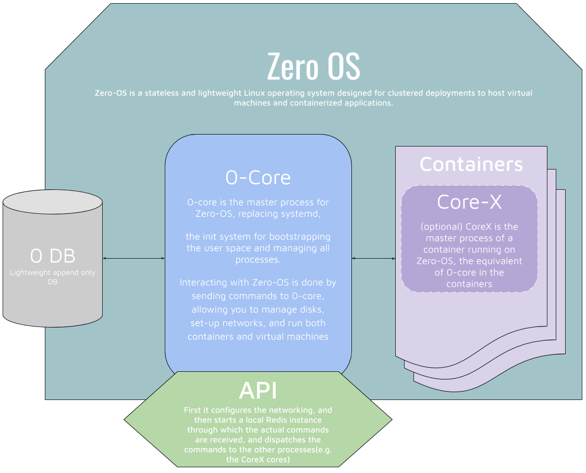

# Getting started

## Prerequisites

* Mac OS X 10.7 (Lion) or newer or a linux OS (tested on ubuntu 18.04)
* Git installed with a github account
* an ssh key added to github
  * go [here](https://help.github.com/en/articles/generating-a-new-ssh-key-and-adding-it-to-the-ssh-agent) to generate a ssh key
  * go [here](https://help.github.com/en/articles/adding-a-new-ssh-key-to-your-github-account) to add a ssh key to your github account
  * to list your public ssh keys `ssh-add -L`
* Docker
  * installation [guide](https://docs.docker.com/v17.12/install/#server)
  * verify installation with `$docker --version`
* Python3
  * installation [guide](https://www.python.org/downloads/)
  * verify installation with `$python3 --version`
* pip3
  * `$sudo apt install python3-pip`
* click python package
  *`$pip3 install click`

## Philosophy

JumpscaleX aka JSX was created at the beginning so that junior system administrators can easily use this tool to manage resources, provision machines, create and deploy containers.

It will evolve even further to be your digital representation that will always be available. Right now this tool works on your machine but soon it will be automatically deployed on the TF grid.
This 3bot, as we call it, will make sure your applications are properly running by creating, monitoring and maintaining your ressources at any time on your behalf.
It will even be able to engage in trade with others and this network of 3bots will act as a decentalized exchange.

Don't worry nobody except you can take control over your 3bot as all your config files are encrypted (securely stored) and your keys never leaves your device.

## Installation : create a Jumpscale X container

### How it works

The python script will load a docker image and start a docker container on your machine. You just need to answer a few questions during the install script. The container will bind a volume between the directory that holds the JSX code and the container (at /sandbox/code). You will be able to connect securely via ssh to this container and launch the shell (aka kosmos) to manipulate the Jumpscale X library .

### Install scripts

```bash
#get the installer
# TODO CHANGE BRANCH WITH MASTER
curl https://raw.githubusercontent.com/threefoldtech/jumpscaleX/development/install/jsx.py?$RANDOM > /tmp/jsx ; \
#install
chmod +x /tmp/jsx; \
/tmp/jsx container-install;
```

#### help

To get more help about the jsx command, type: `/tmp/jsx --help` .

#### _(optional)_ jsx command shortcut

if you want to be able to launch `jsx` directly instead of typing `/tmp/jsx` you should either.

* add it to  your path: `PATH=$PATH:/tmp`

* move the jsx binary to your `/usr/local/bin` :

```bash
sudo mv /tmp/jsx /usr/local/bin
```

## Launching kosmos the jumpscale X REPL(read–eval–print loop) shell

### Easy way

you can launch kosmos the easy way with this command

```bash
#get first time your kosmos shell
$ /tmp/jsx container-kosmos;
```

### Alternative way: connecting to your container through ssh

```bash
# to login to the docker using ssh use (if std port)
$ ssh root@localhost -A -p 9122
root@3bot:~$ source /sandbox/env.sh; kosmos;
```

once kosmos is launched you will see this line

```bash
JSX>
```

# 1. Using kosmos to create a wallet on the ThreeFold blockchain aka TFChain

The ThreeFold blockchain is used as a ledger for the ThreeFold Token ("TFT"), a digital currency backed by neutral and sustainable internet capacity. You can learn more about the ThreeFold token on threefoldtoken.com. For more information check out the docs on the ThreeFold chain [github repository](https://github.com/threefoldfoundation/tfchain).

## Fastest way: create a new wallet
Enter the following instructions to create a client and a wallet:
```python
JSX> c = j.clients.tfchain.new(name='my_client', network_type='TEST')
JSX> w = c.wallets.new("my_wallet")
```

**The `network_type` is important, it specify you want to use the TestNet.**
**Otherwise you will play with real TFT, so be careful**.

### Save your wallet seed

As soon as your wallet is created, please save your seed somewhere.
__This is the only way to get your wallet back for recovery purposes.__

```python
JSX> w.seed
# is equivalent to:
JSX> j.clients.tfchain.my_client.wallets.my_wallet.seed
'trust faculty frame ...' # save these word
```

Once you have a wallet set up, you can direclty go to the [next section to get some TFT token](#-2-tft-token).

## Alternative way

```python
JSX> j.clients.tfchain.new(name='my_client', network_type='TEST')
```

now our client is accessible like this:

```python
JSX> j.clients.tfchain.my_client
```

With your new client, create a TFChain wallet, if you don't already have one.


```python
JSX> j.clients.tfchain.my_client.wallets.new("my_wallet")
JSX> j.clients.tfchain.my_client.wallets.my_wallet.seed
'trust faculty frame ...'
```

to make things more compact we can create variables
```python
JSX> c = j.clients.tfchain.my_client
JSX> w = j.clients.tfchain.my_client.wallets.my_wallet
```

note that all the _new_ commands have another form
```python
JSX> c.wallets.new("pocket_money")
#is equivalent to
JSX> c.wallets.pocket_money
```

## _(optional)_ recover a wallet
If you already have one, you can recover it using its seed:

```python
JSX> w = c.wallets.new('my_wallet', seed='bullet absurd cabin dose void wink toward oven catalog chef venture edge suggest strategy note merry mechanic buffalo bronze creek select walk click snow')
```


Get the first address of your wallet

```python
JSX> w.address
'01d761561e7203276ef2944628bfde5bfcabf0960b69eda69ac1d317bcdcc53af06a0fd08c5f91'
```

you can create more addresses
```python
JSX> w.address_new()
'015cd2821abc03276ef2944628bfde5bfcabf0960b69eda69ac1d317bcdcc53af06a0f65dbcc8'
JSX> w.addresses
['01d761561e7203276ef2944628bfde5bfcabf0960b69eda69ac1d317bcdcc53af06a0fd08c5f91','015cd2821abc03276ef2944628bfde5bfcabf0960b69eda69ac1d317bcdcc53af06a0f65dbcc8']
```

## Saving your work

If you want to be able to quickly get access to your wallet (if for instance you loose the connection with your container) you can save it and all the other objects:

```python
JSX> w.save()
JSX> c.save()
```

* kill your terminal by pressing `CTRL + D`, then
* restart your container and launch kosmos again `/tmp/jsx container-kosmos;`

Note that the instances are still accesible by their name (not by the variable name) from the shell:
```python
JSX> j.clients.tfchain.my_client
## tfchainclient Instance: 'my_client'
JSX> j.clients.tfchain.my_client.wallets.my_wallet
## j.clients.tfchain Instance: 'my_wallet'
```

but the variables don't exist anymore:
```python
JSX> c
name 'c' is not defined
JSX> w
name 'w' is not defined
```

be sure to reassign those variables before going further:

```python
JSX> c = j.clients.tfchain.my_client
JSX> w = c.wallets.my_wallet
```

**Hint : at any moment hit the question mark key to display the interactive help to know more about a function arguments.**

# 2. TFT token

Let's get some test TFT token on our faucet. We will need it to pay for grid capacity.

Get the address of your wallet

```python
JSX> w.address
'01d761561e7203276ef2944628bfde5bfcabf0960b69eda69ac1d317bcdcc53af06a0fd08c5f91'
```

Head to https://faucet.testnet.threefoldtoken.com/ and fill the from with your wallet address.
Then check the balance on your wallet address, after a couple of minutes you should see the `300 TFT` from the faucet.

```python
JSX> w.balance
wallet balance on height 251953 at 2019/04/12 09:39:36
0 TFT available and 0 TFT locked
Unconfirmed: 300 TFT available 0 TFT locked

[... wait some time ...]

JSX> w.balance
wallet balance on height 251955 at 2019/04/12 09:40:50
300 TFT available and 0 TFT locked
```

# 3.Register a ThreeBot

To be able to interact in the threefold grid we need to register a 3bot.
Creating a new 3bot record on the TFChain can be done with your wallet.
We will call the threebot registration function with these arguments:

- `months`: for how long time do you want your 3bot, you pay for that amount of time (default is 1, can be from 1 to 24)
- `names`: list of names which will be used later to identify your 3bot
- `addresses`: list of addresses

**Bot names should follow a specific format**
the bot name must begin with a letter followed by 3 to 61 letters/digits and end with a letter. You can then add a point and follow the same rule.

e.g. of valid name:

* t1000
* t1000.robot
* t1000.terminator
* robot.that1.daycould.easily.surpass.evenmore.than1000humans

e.g. of invalid name:

* 3robot
* t1000.com
* www.t1000.robot

if you want to be sure that your name is valid you can visit [this website](https://regex101.com/) and enter this regular expression `^[A-Za-z]{1}[A-Za-z\-0-9]{3,61}[A-Za-z0-9]{1}(\.[A-Za-z]{1}[A-Za-z\-0-9]{3,55}[A-Za-z0-9]{1})*$`

Then type your name under _test string_. Your name will be highlighted if it is valid.

```python
JSX> result = w.threebot.record_new(
    months=1,
    names=["your3bot.fancyname"],
    addresses=["your3bot.org"])


# transaction that was created, signed and if possible submitted
JSX> result.transaction
transaction V144 c16b76f646c64b6464b646479747f99989ec98985647

# True if submitted, False if not possible due to lack of signatures in MultiSig Coin Inputs
JSX> result.submitted
True
```

you can then check your 3bot registration transaction on the [testnet explorer]
(https://explorer.testnet.threefoldtoken.com/)
You can search the 3bot by name. Here we would enter your3bot.fancyname and click the search button. You should see the detail about the 3bot and a link to the creation transaction.

For mode detail about the 3Bot registration and updates, [go to the full documentation](https://github.com/threefoldtech/jumpscaleX/blob/development/Jumpscale/clients/blockchain/tfchain/README.md#create-and-manage-3bot-records)


# 4. Rent a virtual machine running our light weight, secure and super efficient OS called zero OS on the TF grid



First we should look for a farm that provide what we look for. We have a convenient [website for capacity](https://capacity.threefoldtoken.com) selection.

Let's say that we need at least 2 CPU 4GiB RAM and we need it to be located in austria. We just have to move a few sliders around and we got the [results](https://capacity.threefoldtoken.com/?cru=2&mru=4&country=Austria&farmer=).

The first result is the node ac1f6b84a330 from the _green edge cloud.austria.vienna_  Farmer located in Wien (Austria). Click on the details button if you want more information on that node.

Now that we have the node _id_ that suits our need we will book the capacity:

```python
JSX> result = w.capacity.reserve_zos_vm(
    email='user@email.com',       # the email on which you will received the connection information
    threebot_id='your3bot.fancyname', # your threebot id, it can be any of the names you gave to your 3bot
    location='ac1f6b84a330',         # name of the farm or node id where to deploy the workload
    size=2                        # each workload have a different size available
)
```

**Be sure to enter a valid email as we will receive the IP of our reserved virtual machine by mail.**

As soon as it is ready, usually within a few minutes, you will receive an email with the connection information.

# 5. Connect to your virtual machine

Any workload deployed on the grid will be reachable on the public threefold network.

This also means any workload in this network is able to communicate to any other workload deployed anywhere else on the grid, you can see it as the internet of the grid.

As long as you don't have to expose your services to the outside of the grid, this network is all you need to use.

This public threefold network is a zero tier public network with the id `9bee8941b5717835`

* Download and install the [zerotier application](https://www.zerotier.com/download.shtml).
* connect to the network `$sudo zerotier-cli join 9bee8941b5717835`
* verify that you are connected by listing the zerotier networks

```bash
$sudo zerotier-cli listnetworks
.....9bee8941b5717835 tfgrid_public 36:f5:2f:5b:f6:b9 OK.....
```

if you want to quit the network `$sudo zerotier-cli leave 9bee8941b5717835`

Previously when we booked a virtual machine we received a mail that contains a 0-bot url. Now that we are connected we can reach that url e.g., `0-robot url: http://10.244.28.174:6600`. If you browse that url you should be able to see the 0-robot homepage.

Inside the mail you will also find your zos _ip_ e.g.,`0-OS address: 10.244.28.174:6379` . You can use Kosmos shell to connect to it.

```python
JSX>j.clients.zos.get("my_vm", host="${your_zos_ip_here_without_the_port}")

# Check for connectivity
JSX> vm.ping()
'PONG Version: master @Revision: b1a1a737352fce69fd71de5f8cf1ae175f4bdcab'
```

more information about threefold networks [here](https://github.com/threefoldtech/home/blob/master/docs/threefold_grid/networks.md#public-threefold-network-9bee8941b5717835)

# 6. Convert a docker file to a flist

Zero-OS containers are booted using a flist. A flist is basically a recipe of files and folders with pointers to the actual content of the filesystem with which the container is started. These files will get downloaded from the storage backend (typically the [Zero-OS Hub](https://hub.grid.tf/)) when needed.

In this tutorial, we will create a flist ourselves, upload it to the Zero-OS Hub, and then use it to start a Zero-OS container to which we will connect to over its ZeroTier management network.

We'll use a [simple website](https://hub.docker.com/r/nginxdemos/hello/) served by nginx to illustrate creating a flist.

So there are basically two steps:

 * Create the flist
 * Start the container

## 6.1 Creating the flist

Creating a flist is done in two steps:

* First we need to assemble the files and folders we need in the resulting filesystem into a tar.gz archive locally
* Then we need to publish that archive to the hub (https://hub.grid.tf)
The second step will actually result in the creation the flist.

As we already have a docker image we will take advantage of our [docker to flist](https://hub.grid.tf/docker-convert) application. It will automatically create the tar.gz archive and publish it on the hub for us !

Go to the [docker converter page](https://hub.grid.tf/docker-convert) and login (you will need to register first).

Then enter the docker image `nginxdemos/hello` in the corresponding input field and click the __convert docker image__ button.
You should see a success message with your flist url like this:

```
Well done
Your flist nginxdemos-hello-latest.flist is available.

To start a container, use the following information:

Source: https://hub.grid.tf/ben_mat_1/nginxdemos-hello-latest.flist
Storage: zdb://hub.grid.tf:9900
```

## 6.2 Start the container

We will create a container on our previsously reserved zos virtual machine.
If you can connect to your zos vm (see above) you can start making a container with our newly created flist.

```python
JSX> j.clients.zos.my_vm.containers.create(name="simple-nginx-website", flist="https://hub.grid.tf/ben_mat_1/nginxdemos-hello-latest.flist", ports={'8081':80})
JSX> site = vm.containers.get(name="simple-nginx-website")
JSX> site.is_running()
True
```
Note that we have mapped the port 80 on the container to the port 8081 on the host vm _ports={host:container}_

That's it ! If everything works as expected, you should be able to reach your nginx served website via http://[your_zos_ip]:8081

### Stream logs
First we need to find the id of the nginx process running in our container
let's check all the processes that are running on our container
```python
JSX> site.client.job.list()
[
    {'cpu': 0, 'rss': 3555328, 'vms': 14069760, 'swap': 0, 'starttime': 1559737984120, 'cmd': {'id': 'entry', 'command': 'core.system', 'arguments': {'args': ['-g', 'daemon off;'
                ], 'dir': '/', 'env': {'NGINX_VERSION': '1.13.8', 'PATH': '/usr/local/sbin:/usr/local/bin:/usr/sbin:/usr/bin:/sbin:/bin'
                }, 'name': 'nginx'
            }, 'queue': '', 'stream': False, 'tags': None
        }, 'pid': 9
    },
]
```
Here above we can see that the nginx process has the id _entry_.
Let's stream the output of the process
```python
JSX>sub = site.client.subscribe('entry')
JSX>sub.stream()
10.244.211.254 -[1/Jun/2019:13:55:49 ] "GET / HTTP/1.1" 200 7225 "-" "Mozilla/5.0 (X11; Linux x86_64) Chrome/"
```

# 7. Go further with Jumpscale X

## What have we done with it so far ?

 * Connect and interact with the ThreeFold blockchain (TFT token)
 * provision virtual machines on the ThreeFold grid
 * deploy containers
 * build (builders) and deploy flist (light weight and secure container)
and much more

the kosmos shell interface is intuitive and doesn't need you to learn a syntax.
You have builtin types schema and database.


## Play around with schema

for instance you can define schema (data structure) like this
```python
JSX>my_schema_text = """
@url = my.first.schema.1
mynumber = 42
mydate = 0 (D)
mylist = "1,2,3" (L)
mybool = 0 (B)
mystring= "yolo" (S) #you only live once
mymoney = "10 USD" (N)
myenum = "red,green,blue" (E) #first one specified is the default one
mydictionary = {"number": 468} (dict)
"""
JSX> my_schema_object = j.data.schema.get_from_text(my_schema_text)
JSX> my_schema_instance = my_schema_object.new()
#you can then do
JSX> my_schema_instance.mynumber
42
JSX> my_schema_instance.mybool = True
JSX> my_schema_instance.mybool = true
JSX> my_schema_instance.mybool = 1
JSX> my_schema_instance.mybool = "true"
#all the above commands will have the same result
```

now try :

```python
JSX> my_schema_instance.mymoney.value_currency("eur")
8.45101
# which is the equivalent in eur of our 10$ previously defined in the schema_text
```

play around and try these commands and check the value or the property:

```python
JSX> my_schema_instance.mylist = "yolo,42,kawai"
JSX> my_schema_instance.mylist
JSX> my_schema_instance.mylist = [1,[2,5],"yolo"]
JSX> my_schema_instance.mylist
JSX> my_schema_instance.myenum = 2
JSX> my_schema_instance.myenum
JSX> my_schema_instance.mymoney = "10k GBP"
JSX> my_schema_instance.mymoney
JSX> my_schema_instance.mymoney.usd
JSX> my_schema_instance.mymoney = my_schema_instance.mymoney * "10%"
JSX> my_schema_instance.mymoney
JSX> my_schema_instance.mydate = "18/04/1980"
JSX> my_schema_instance.mydate
JSX> my_schema_instance.mydate = "01/18"
JSX> my_schema_instance.mydate
JSX> my_schema_instance.mydate = "+4d"
JSX> my_schema_instance.mydate
JSX> my_schema_instance.mydictionary["number"]
JSX> my_schema_instance.mydictionary["string"] = "iolo"
```

Jumpscale X relies on several _Domain Specific Language_ like the one used by the schema this approach is more efficient than a librairie because you don't need to be a developer to use it.

## Capacity reservation

If you want to know more about capacity reservation like :

* Make your container accessible from internet
* reserve S3 archive storage
* reserve a Zero DB namespace
check out this [documentation](https://github.com/threefoldfoundation/info_grid/blob/development/docs/capacity_reservation/README.md)

## Builders

[Builders](https://github.com/threefoldtech/jumpscaleX/tree/master/docs/Internals/builders)
are a way to create flist.

flist can be deploy inside a zos and package an application.
flist can be built on flist
take a look at [jumpscale/builders](https://github.com/threefoldtech/jumpscaleX/tree/master/Jumpscale/builder)
