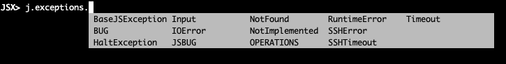

## Exceptions



```python
raise j.exceptions.NotImplemented("....")
```

its important to use these,
if you want to create your own inherit from j.exceptions.BaseJSException

### the list

```python
raise j.exceptions.BaseJSException("")
raise j.exceptions.Input("")
raise j.exceptions.NotFound("")
raise j.exceptions.RuntimeError("")
raise j.exceptions.Timeout("")
raise j.exceptions.BUG("")
raise j.exceptions.IOError("")
raise j.exceptions.NotImplemented("")
raise j.exceptions.SSHError("")
raise j.exceptions.HaltException("")
raise j.exceptions.JSBUG("")
raise j.exceptions.OPERATIONS("")
raise j.exceptions.SSHTimeout("")
```