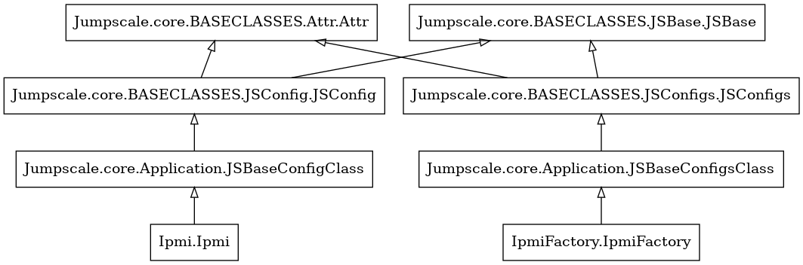

# JSX Baseclasses

## Index
- [Intro](#intro)
- [Baseclasses](#base-classes)
    - [JSBase](#jsbase-class)
    - [JSAttr](#jsattr-class)
    - [JSConfigsFactory](#jsconfigsfactory-class)
    - [JSConfigs](#jsconfigs-class)
    - [JSConfig](#jsconfig-class)
- [Jumpscale generated](#jumpscale-generated)
- [See More](#see-more)

## Intro
In order to understand the jumpscaleX baseclasses we will take this simple example to figure out the hierarchy. BaseClasses are the parent of everything like config manager, clients, builders, servers .. etc. 

Also they contain a lot of functions to help in logging, caching, auto completion in shell, config manager instance managment.

As we see in the following diagram [IPMI client](https://github.com/threefoldtech/jumpscaleX/tree/development_jumpscale/Jumpscale/clients/ipmi) 

So if need to know how a client comes from: 
- The top parent class will be `JSBase` class.
- The factory (which has the base features for instances) inherits from `JSBaseConfigs` class and composes the client as a child class.
- The client (The instance) also inherits from `JSBaseConfig`  

We will go through them in details the next parts

## Base Classes
## JSBase Class
This is the baseclass used by all other base classes, Its the lowest level one. Every object in Jumpscale inherits from this one.

### JSBase main functions
**1- Initialization of the class level**  
    
walk to all parents, let them know that there are child classes, each child class has `__jslocation__` variable which defines it's location as a short path 
    for example: `j.builders.db.zdb.build()`
    To execute this command db builders's dir has a factory class which has location variable `__jslocation__ = "j.builders.db"` also to point to all child classes. same goes with clients, servers, ..etc 
    This is done in `__init_class` method

**2- Logging**  
    
All jumpscale logging methods and logic are implemented in JSBase.
    Logs have levels you can pass it as a parameter through `_logger_set()` method 
    param min_level if not set then will use the LOGGER_LEVEL from
    `sandbox/cfg/jumpscale_config.toml`,
    make sure that logging above minlevel will happen, std = 100
    if 100 means will not log anything  
        - CRITICAL 	50  
        - ERROR 	40  
        - WARNING 	30  
        - INFO 	    20  
        - STDOUT 	15  
        - DEBUG 	10  
        - NOTSET 	0   
    if parents and children: will be set on all classes of the self.location e.g. j.clients.ssh (children, ...)
    if minlevel specified then it will always consider the logging to be enabled 

__Logging Methods__ 
- `log()`: method takes whatever you want to log, also has a parameter log-level
- `_logging_enable_check`:  check if logging should be disabled for current js location
- `_logger_enable()`: will make sure self._logger_min_level = 0 (is for all classes related to self._location.  
- `_log_debug` : method to log a debug statement.  
- `_print` : print to stdout but also log.  
- `_log_info` : method to log a info statement.  
- `_log_warning` : method to log a warning statement.  
- `_log_error` : method to log an error statement.  
- `_log_critical` : method to log a critical statement.  

**3- Logic for auto completion in shell**  
- To make autocompeletion in kosmos shell, we need to know the children of each class and the methods or properties in it also the data if it contains, we will walk through the methods that do so.
- `__name_get`: Gets each name for instances in factory.
for example in `j.builders.db` it gets names in DBFactoryClass, zdb, mongo .. etc

- `_filter`: Check names to view only required once which means it won't show names starts with "_" or "__" unless you type it. It uses other methods as helpers like `_parent_name_get`, `_child_get` ..

- Output is shown through `__str__` method.

**4- State on execution of methods (the _done methods)**  
- We can consider it as a flag to save the state of execting methods.
- `_done_set`: saves that this method had been executed so, it won't run again unless you change the state
also there are other methods in this arena; `_done_delete`, `_done_reset`,`_done_check`, `_done_key`

## JSAttr Class
- Joins JSBase as a lower level class which objects inherit from. It Deals with set & get attributes as we deals with short names, via jumpscale generated 

#### Methods:
- `__getattr__`  
Gets class attriubte from child instances, doesn't return private or non child attributes

- `__setattr__`:  
Takes key, value and set's the instance attribute

## JSConfigsFactory Class
This class is the factory for multiple JSConfig/JSConfigs baseclasses and its objects.
It contains some methods that help both of them to make the config manager. It deals directly with BCDB (Block chain database) always uses the system BCDB, unless if this one implements something else.

Can have a `__jslocation__`, meaning it will be attached somewhere in the Jumpscale namespace.

It can optionally be a container for one or more config classes, that is why it is not `_CHILDCLASS` here but `_CHILDCLASSES`.

The _CHILDCLASSES are one or more config(s) classes, always defined as a (Python) List.

A childclass can be a singleton (means just add a JSConfig class)

**Methods**
- `delete()`: deletes the instance (child object).
- `save()`: save new instance in bcdb with it's configurations.

## JSConfigs Class
Is the base class for the factories (a collection of config objects), allowing you to create instances of the _CHILDCLASS on the fly (composition).

It has the base methods used in clients which deals with childclasses; creating, deleting, reseting, finding.

**Methods**
- `_process_schematext()`:  As configurations uses a schema, this methods rewrites the schema in such way there is always a parent_id and name.

- `_bcdb_selector()`: select bcdb namespace, always uses the system BCDB, unless if this one implements something else.

- `_childclass_selector()`: allow custom implementation of which child class to use.

- `new()`: Create new config (instance) from a server, client must have a unique name and other configs could be entered later.

- `get()`: Gets an object from the instance.

- `exists()`: Checks if the instance already created.

- `reset()`: will destroy all data in the DB, will delete all existed instances.

- `find()`: Search for instance or list of instances by keys.

- `count()`: Count the child instances and return its length.

- `delete()`: Delete a specific instance.

## JSConfig Class
Is the base class for a config instance object could be a client, server, classes who use JSXObject for data storage but provide nice interface to enduser.

**Methods**
- `edit()`: edit data of object in editor. chosen editor in env var: "EDITOR" will be used

- `_trigger_add`: Triggers are called with (jsconfigs, jsconfig, action)
can register any method you want to respond on some change
- jsconfigs: the obj coming from this class, the collection of jsconfigs = jsxconfig_object
- jsconfig: the jsconfig object
- action: e.g. new, delete, get,stop, ...

- `_triggers_call()`: will go over all triggers and call them with arguments given

- `_data_update()`: will not automatically save the data, don't forget to call self.save()

## Jumpscale Generated

- To make all short paths jumpscale is generating all its modules and files in `{DIR_BASE}/lib/jumpscale/Jumpscale/*` and fetches it via `{DIR_BASE}/lib/jumpscale/Jumpscale/jumpscale_generated.py`, so actually j.anything comes from this file. If you do new class don't forget to update it via `$ js_init generate`

## See More
**Nested clients**
- Like [TFChain](https://github.com/threefoldtech/jumpscaleX/blob/development_jumpscale/Jumpscale/clients/blockchain/tfchain/TFChainClient.py) client relation with [Wallet](https://github.com/threefoldtech/jumpscaleX/blob/development_jumpscale/Jumpscale/clients/blockchain/tfchain/TFChainWallet.py) client 
    - TFChain Factory has a child object class of TFChain Client.
    - Also TFChain Client has a child object of Wallet Factory
    - Finally Wallet Factory has a child object class of Wallet Client.

Explained more in this example from [Jumpscale Tutorials](https://github.com/threefoldtech/jumpscaleX/blob/development_jumpscale/Jumpscale/tutorials/base/tutorials/object_structure/1_object_structure.py)

