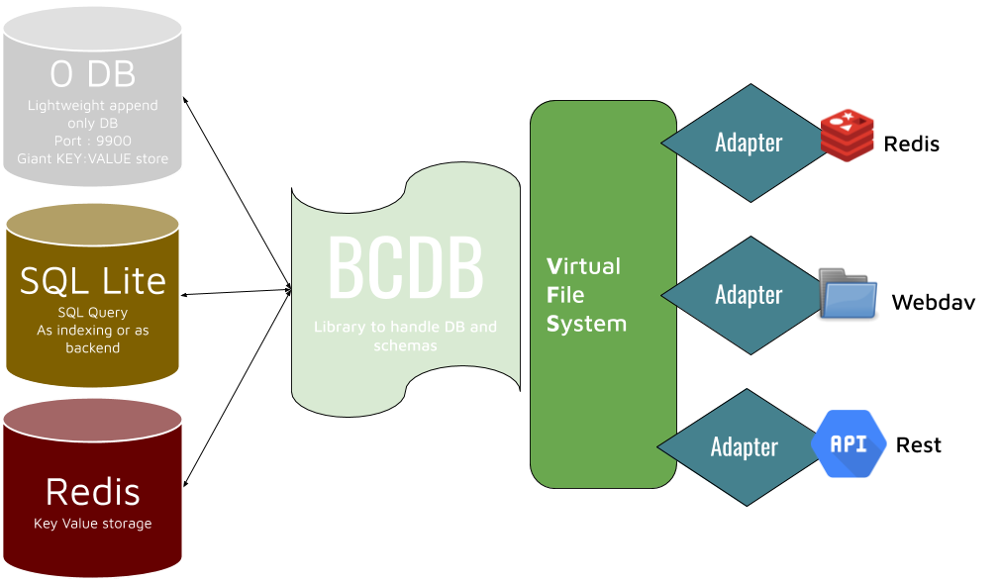

# BCDB technical overview

BCDB is a librairie to index and store data

## indexing
Indexing is done with redis and sqlite

__Why do we need to set Ids__

You cannot iterate otherwise because the backend store is append only. So if you would like to iterate over a specific susbset like a namespace and a model you wouldn't know what to iterate over.
### TODO Property indexation
__indexes are the location of objects stored in store ?__
### TODO Object indexation

## Store of data (as binary)
to store the data we can use either sql lite, 0db or redis


behind bcdb there is sql lite, 0db and redis
* sql for the query functionnalities
* redis key value fast 1Millions key in memory only 20mb
* zdb key value - append only - fast db

__When do we need redis over zdb ?__. 

For instance when dealing with jobs for each one we need a record that will be updated when the job
 does something if we would use zdb it will grow like crazy as it is append only but with redis it will just overwrite. 

__why redis__
has a built in replication mechanism that we can use now

__What's next ?__

We will add the support of sonic to make full text search available

Sonic is an open-source search index server, written in Rust. It was built with simplicity, performance and lightweight-ness in mind. Sonic takes user queries in, and return identifiers. Those identifiers refer to actual documents in a relational database (eg. in our case: messages, helpdesk articles, CRM contacts, etc). Sonic does not store documents, which makes the whole system simple and efficient regarding storage, as an application getting search results from Sonic has to pull actual result data from another database (eg. MongoDB, MySQL, etc. given the search results IDs that are returned).

## BCDB Objects
### BCDB
You can have many BCDB instances.  
one BCDB object corresponds to one database. 

it is identified by its name e.g. test
you can have multiple schema from one url (different versions)

### Schemas  
we can access the schemas dictionnary in `bcdb.meta.data.schemas`
A Model is based on only one schema. think of the schema as a text defining the structure 
of a data table and the model is the databale object.
To get a model corresponding to a schema we have several options 
* through the schema text itself 
    * the fastest and more straight forward method  `bcdb.model_get_from_schema()`
* through the property url of the schema  
    * we find the corresponding schema text based on the schema url to call the method `bcdb.model_get_from_schema()`
* through the md5 hash of the schema  
    * we find the corresponding schema text based on the schema md5 hash to call the method `bcdb.model_get_from_schema()`
* through the schema id 
    * we find the corresponding schema text based on the schema id to call the method `bcdb.model_get_from_schema()`

### BCDBModel
A BCDBModel object is iterable and take the namespace id as parameter.
```
JSX> model = bcdb.model_get_from_schema(schema_text)
JSX> model.iterate($nid)
```
Or ,as the ID is incremented for all the database, meaning that you __will not have the same object id__ for objects in different namespace, we can get the object directly with its id.
```
JSX> model($id)
```


## BCDB Virtual file system
The idea is to have a VFS as a front to BCDB and adaptaters that will take advantage of this VFS to provide extra connectivity


it allows you to navigate through the BCDB like it was a file system.
the root directory is the bcdb name.


Here is the file system directories
```
    /data
        /nid
            /sid
                /1
                    object1
                    object2
            /hash
                /0eccf565df45
                    object1
                    object2
            /url
                /ben.test.1
                    object1
                    object2
    /schemas
        /sid
            1
        /hash
            0eccf565df45
        /url
            ben.test.1
        /url2sid
            ben.test.1
    info
```   
eg. test/data/2/url/ben.test.1/object1, test/schemas/hash/0eccf565df45 

if bcdb name is set eg. /data/2/url/ben.test.1/, data/2/url/ben.test.1/object2,

On each level we can do 
- get 
    - retrieve a file or a directory given the specified path
- len
    - file length if the current path is a file
    - throws if the current path is a directory
- set
    - set a file inside the current path
    - throws if the current path is a directory
- list 
    - List the files of a directory
    - throws if the current path is a file
- delete
    - delete a file or a directory given the specified path

  

### client to DB
zdb client communicate with 0db and uses redis protocol
rdb client is compatible with 0db client but uses redis as a backend 


 

# Technicals
## Connect to the j.core.db
There is one redis database that is always running when you have launched kosmos
on port 6379. To connect to it from outside your container you need to remove the protected mode.

in your container run the `redis-cli` in `/usr/bin/redis-cli`
and send this command
```
CONFIG SET protected-mode no
```
## Look at your BCDB configuration
```
JSX> data_encrypted = j.sal.fs.readFile('/sandbox/cfg/bcdb_config', binary=True)
JSX> data =j.data.nacl.default.decryptSymmetric(data_encrypted)
JSX> data
b'\x84\xa6system\x82\xa6nsname\xa6system\xa4type\xa6sqlite\xabtest_export\x82\xa6nsname\xabtest_export\xa4type\xa6sqlite\xa5test2\x86\xa6nsname\xa5test2\xa4addr\xa9127.0.0.1\xa4port\xcd&\xad\xa4mode\xa3seq\xa6secret\xa512345\xa4type\xa3zdb\xa4test\x82\xa6nsname\xa4test\xa4type\xa6sqlite'
JSX> j.data.serializers.msgpack.loads(data)
{'system': {'nsname': 'system', 'type': 'sqlite'}, 'test_export': {'nsname': 'test_export', 'type': 'sqlite'}, 'test2': {'nsname': 'test2', 'addr': '127.0.0.1', 'port': 9901, 'mode': 'seq', 'secret': '12345', 'type': 'zdb'}, 'test': {'nsname': 'test', 'type': 'sqlite'}}
```
if you want to look at the data itself when sqlite is used you can find the file in this location:
```
/sandbox/var/bcdb/$BCDB_NAME/sqlite.db
```
