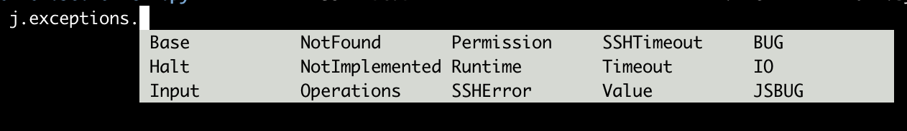
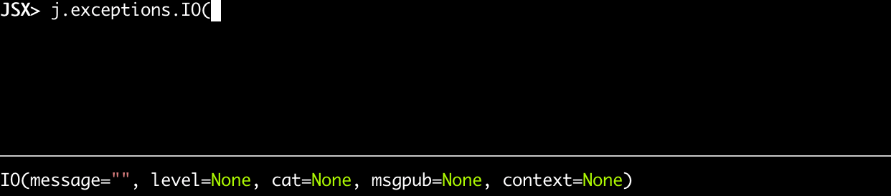

# Exception Handling

## principles

- do not overwrite sys.excepthook EVER !!!

## if you really have to intercept error

always do as follows:

```python
try:
    print("DO SOMETHING WHICH MAYBE GIVES ERROR")
except Exception as e:    
    j.errorhandler.exception_handle(e,die=True) #or die =False if you don't want to stop
```

never let an error go without handling !!!!

## how to add you're own handling to exceptions

register a handler to the ```j.errorhandler.handlers```

```python
def errorhandler(logdict):
    #do something with the logdict
j.errorhandler.handlers.append(errorhandler)
```

see [logdict](logdict.md) for format info
We use the logdict as generic format for the handling.

## ready to use exception handlers



- Base
- Permission
- Halt
- Runtime
- Input
- Value
- NotImplemented
- BUG
- JSBUG
- Operations
- IO
- NotFound
- Timeout
- SSHError
- SSHTimeout

the initialization for them all

```python
BaseJSException(message="something", level=None, cat=None, msgpub=None,context=None,exception=None)
```

- context is e.g. location where something happened
- cat is any category e.g. in dot notation
- 

## raising of errors



```python
raise j.exceptions.NotImplemented("....")
```

its important to use these,


### the list

```python
raise j.exceptions.Base("wow unknown error",context="unknown.brussels.room1",msgpub="call the firebrigade now")
raise j.exceptions.Input("")
raise j.exceptions.Value("")
raise j.exceptions.Permission("")
raise j.exceptions.NotFound("")
raise j.exceptions.Runtime("")
raise j.exceptions.Timeout("")
raise j.exceptions.BUG("")
raise j.exceptions.IO("")
raise j.exceptions.NotImplemented("")
raise j.exceptions.SSHError("")
raise j.exceptions.Halt("")
raise j.exceptions.JSBUG("")
raise j.exceptions.Operations("")
raise j.exceptions.SSHTimeout("")
```

## best practice

- do not do ```raise RuntimeError...``` always call one of above

## exception properties

- exception levels  (are the same as the log levels)
  - CRITICAL 	50
  - ERROR 	40
  - WARNING 	30
  - INFO 	    20
  - STDOUT 	15
  - DEBUG 	10

- exception is the exception which comes from e.g. a try except, its to log the original exception (the parent)

```python
try:
    dosomething_which_gives_error(data=data)
except Exception as e:
    raise j.exceptions.Value("incredible error",cat="firebrigade.ghent",data=data,original_exception=e)
```

arguments
- **message**: message a meaningful message
- **level**: see above
- **cat**: dot notation can be used, just to put your error in a good category
- **context**: e.g. methodname, location id, ... the context (area) where the error happened (exception)
- **data**: any data worth keeping 
- **exception**: see above

```python
class BaseJSException(Exception):
  
    def __init__(self, message="", level=None, cat=None, msgpub=None, context=None, data=None, exception=None):

```

to check if an exception is of this base (jumpscale Exception)

```python
isinstance(exception,j.exceptions.Base)
```

## create your own exceptions

This is not a best practice!!! we prefer you use the predefined ones.

if you want to create your own inherit from ```j.exceptions.Base```

```python

class MyErrorEscalation(j.exceptions.Base):

    def _init(message="", level=None, cat=None, msgpub=None, context=None)):
        #use this to intialize if needed
        pass

raise MyErrorEscalation(level=40,
    context="unknown.brussels.room1",
    msgpub="call the firebrigade now")

```

