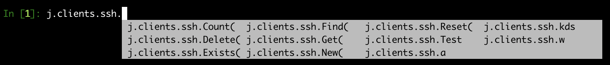

# j.application.JSBaseConfigsClass

Is the base class for a collection of config objects,
allowing you to create instances of the `_CHILDCLASS` on the fly.

## example

No params for init.

```python
class SSHClientFactory(j.application.JSBaseConfigsClass):

    __jslocation__ = "j.clients.ssh"
    _CHILDCLASS = SSHClientBase

    def _init(self):
        #custom initialization
        self._something = {}

    def _childclass_selector(self,**kwargs):
        #EXAMPLE WHERE WE CHOOSE OTHER CHILD DEPENDING ENVIRONMENT
        if j.core.platformtype.myplatform.platform_is_osx:
            return SSHClientParamiko
        else:
            return SSHClient

    def test(self):
        '''
        js_shell 'j.clients.ssh.test()'
        '''

        s=j.clients.ssh.test1
        s.addr="a.b.c.d"
        s.port=1053
        s.sshkey_name="test"

        j.clients.ssh.test2.data_update(addr="a.b.c.e", port=1054, sshkey_name="test2", passwd="passwd")
        print (j.clients.ssh.test2)

        assert j.clients.ssh.test2.port == 1054


        #j.clients.ssh.test2.shell()  #NOT TO BE DONE IN TEST but can use to do ssh
```



- a,kds,w are instances to get to them do

```python
In [1]: j.clients.ssh.a
Out[1]:
sshclientparamiko
{
 "addr": "",
 "addr_priv": "",
 "allow_agent": true,
 "clienttype": "",
 "forward_agent": true,
 "login": "root",
 "name": "a",
 "passwd": "",
 "port": 22,
 "port_priv": 22,
 "proxy": "",
 "sshkey_name": "",
 "stdout": true,
 "timeout": 60
}
```

## methods

```python

class JSBaseConfigs(JSBase):

    def __init__(self):
        self._model = IS THE JSMODEL
        self._children = ARE THE CHILDREN LINKED TO THIS CONFIGS OBJ, US ALWAYS OF 1 JSOBJECT TYPE

    def _childclass_selector(self):
        """
        allow custom implementation of which child class to use
        :return:
        """
        return self.__class__._CHILDCLASS


    def new(self,name,**kwargs):
        """
        :param name: for the service
        :param kwargs: the data elements
        :param childclass_name, if different typen of childclass, specify its name
        :return: the service
        """


    def get(self,name=None,id=None,die=True ,create_new=True,**kwargs):
        """
        :param id: id of the obj to find, is a unique id
        :param name: of the object, can be empty when searching based on id or the search criteria (kwargs)
        :param search criteria (if name not used) or data elements for the new one being created
        :param die, means will give error when object not found
        :param create_new, if True it will automatically create a new one
        :param childclass_name, if different typen of childclass, specify its name, needs to be implemented in _childclass_selector
        :return: the service
        """

    def reset(self):
        """
        will destroy all data in the DB, be carefull
        :return:
        """

    def find(self,**kwargs):
        """
        :param kwargs: e.g. color="red",...
        :return: list of the config objects
        """


    def count(self,**kwargs):
        """
        :param kwargs: e.g. color="red",...
        :return: list of the config objects
        """


    def findData(self,**kwargs):
        """
        :param kwargs: e.g. color="red",...
        :return: list of the data objects (the data of the model)
        """

    def delete(self,name):
        """
        deletes the config with the name specified
        """

    def exists(self, **kwargs):
        """
        """
```

## Custom name

Should your `JSBaseConfigsClass` not be bound to a `__jslocation__` but be
one of the `__CHILDCLASSES` of a `JSBaseConfigParentClass`, you can define the name under
which it will appear (within the space of that `JSBaseConfigParentClass`
by overriding the `_name` class property of the `JSBaseConfigsClass` in question.

For example:

```python
from Jumpscale import j

class CountryClass(j.application.JSBaseConfigsClass):
    """
    some text explaining what the class does
    """
    _CHILDCLASS = Province
    _name = 'country`
```
