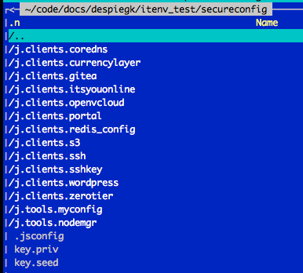
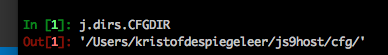

# principles of configuration management in jumpscale 9.3

## location of configuration management information

jumpscale checks where the config directory is in 3 steps.

- step 1: check the current directory to see there is a secureconfig directory
- step 2: walk over git repo's find your secureconfig git repository
- step 3: fall back on default location

step 2/3 only happens once, then the path and other required params get stored in 


### step 1: if you are in a directory which has config info inside

the system checks that the following dirs exist

- $curdir/secureconfig
- $curdir/keys

if secureconfig exists then the config files will only be fetched from here.
if keys exist then it expects only 1 key inside and will load it in the ssh-agent
this key will then be used for decryption/encryption of the private info in the secure config

if secureconfig exists but not the keys dir, then ssh-key from host os will be used




if jumpscale finds the .jsconfig directory then it will consider that directory to be the source of your configuration information, it will not look into the default location.

This mode is very useful to together work in a directory with multiple people and host it in e.g. a secure git repo.
This allows everyone to use the same configuraiton information.

if config dir found step 2/3 will not be done, the system will now only use info from the config directory

### how will system find the sshkey for the encryption/decryption

- step1: check if key directory exists and only 1 key
- step2: check if defined in j.core.state.config_js (see below), if yes load in ssh-agent and use
- step3: if not defined yet in config file and not in subdir key then will do the following

#### ssh key will be found during init as follows

- check in ssh-agent, if only 1 there then will use this one (if silent mode)
- check in .ssh dir if only 1 there will use , if more than 1 will ask the user which one to use (if not silent mode), otherwise error if more than 1

the selected ssh-agent will be configured in j.core.state.config_js (see below)

### step 2/3:

check for myconfig info in ```j.core.state.config_js``` which is in 


you can check in

```python
print(j.core.state.config_js)
```

example section in config file

```json
 {'dirs': ...
 'myconfig': {'giturl': 'ssh://git@docs.grid.tf:7022/despiegk/config_despiegk.git',
  'path': '/Users/kristofdespiegeleer/code/docs/despiegk/config_despiegk',
  'sshkeyname': 'kds'},
```

this will point to local git based configuration directory (is in code directory)

if no configuration directory like this exists then it will create one in default location

#### how is the configuration directory found?


when ```cfg["myconfig"]["path"]``` is empty will try to find the config directory in git as follows

- will walk over all git repos which are stored on right location (when using js_code)
   -  $HOMEDIR/code/$type/$account/$reponame  $type e.g. docs or github
-  will look for ```.jsconfig``` in root of the git repo
-  if found only1 this will be the config directory used and put in config file see above 


### step 3: default configuration location

if not found in git repo then will put it in 

```
'%s/myconfig/' % j.dirs.CFGDIR
```



this is the last resort


