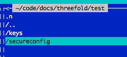
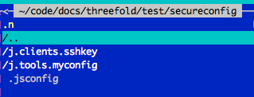
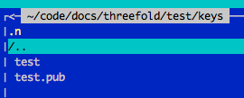

## Config Manager

Jumpscale 9.3.0 introduces a secure configuration manager that makes sure that private configuration data is NACL encrypted on the filesystem.

### read more about config file locations

[config_file_locations.md](config_file_locations.md)

### how to create your own config directory

1.  create a git repo under j.dirs.CODEDIR
2.  run `js_config init`. This will mark this repo as your configuration repo
3.  Start creating your configuration instances

it will ask for the right locations

you can also do such an initialization silently see [init_silent](init_silent.md)

### Configuring

to configure a client from the cmdline

```
js_config configure -l j.clients.openvcloud -i test -s /root/.ssh/id_rsa
```

* the -s is not needed it will find the directory for you and use default locations

where

* `-l` denotes the jslocation of the client to be configured
* `-i` the instance name of this configuration
* `-s` the ssh key used in encryption/decryption

### internals


### reset

to reset config instance

```
js_config reset -l j.clients.openvcloud -i test
```

note that if not instance name provided all instances for this client will be reset, you can also run `js_config reset` without location or instance name to delete all configs

### how to create a sandbox in a git repo

create a git repo, go there and do:

```bash
js_config sandbox
```

this will create something like







example configure script which will inser configuration information in local secure config

```python
from jumpscale import j


def configure_zerotier():
    j.clients.zerotier.get(
        'main', data={'token_': 'gc2jHysuzN2tXpzsdsdsTCX5nxN5K1VE', 'networkID_': '17d70943sdsdsc661'})


def configure_ovc():
    data = {
        'address': 'be-gen-1.demo.greenitglobe.com',
        'port': 443,
        'jwt_': 'sdfohasdifgjkhsdlfigukhjasdligfjhadsfligjkhasdflgkyJ1c2VyOmFkbWluIl0sInVzZXJuYW1lIjoiZGVzcGllZ2sifQ.YPqeTFR7F64oLYVV8ZIeVIy2N0xEMCmNYrCF6FF7wuEu6WW9kyNUEzyTLjNFoWTJ9p0rw2ueWk3hi14s6CsJymYivFv2aSEgE982qshMMyfbvsAv9-vzEsuFfjN06a86'
    }
    j.clients.openvcloud.get('main', data=data)


def configure_s3():
    j.clients.s3.get_manual("s31", "ns3003266.ip-37-59-7.eu", 9000, "O3BWLOD0IXJFJQBAUET6",
                            "asdfasdfgasdgfadsfgafdgaldjfsghkasjdghfiaj")


# # make sure zerotier pip installed
# j.tools.prefab.local.runtimes.pip.install('zerotier')
# j.tools.prefab.local.runtimes.pip.install('minio')


configure_ovc()
configure_zerotier()
configure_s3()
```
