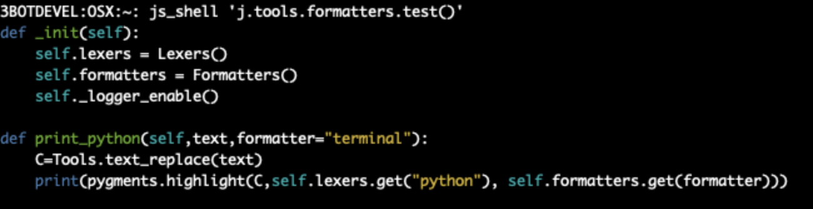
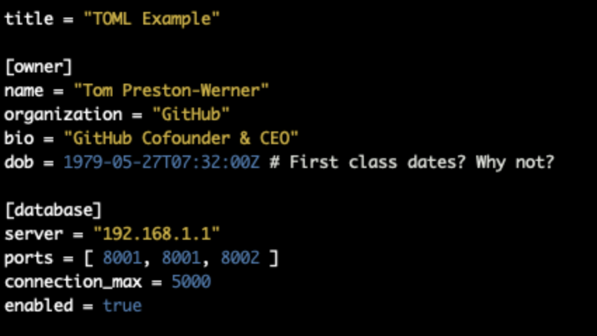
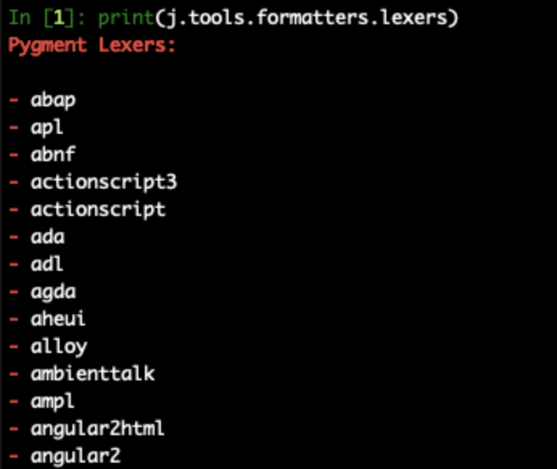

# How to print python, toml, to console with colors & nice formatting

# print python formatted text

```python

j.tools.formatters.lexers.bash
j.tools.formatters.lexers.python3
j.tools.formatters.formatters.terminal

C="""
def _init(self):
    self.lexers = Lexers()
    self.formatters = Formatters()
    self._logger_enable()

def print_python(self,text,formatter="terminal"):
    C=Tools.text_replace(text)
    print(pygments.highlight(C,self.lexers.get("python"), self.formatters.get(formatter)))


"""

j.tools.formatters.print_python(C)
```



# print toml formatted text

```python

C="""

title = "TOML Example"

[owner]
name = "Tom Preston-Werner"
organization = "GitHub"
bio = "GitHub Cofounder & CEO"
dob = 1979-05-27T07:32:00Z # First class dates? Why not?

[database]
server = "192.168.1.1"
ports = [ 8001, 8001, 8002 ]
connection_max = 5000
enabled = true
        
"""

j.tools.formatters.print_toml(C)


```




# how to find lexers / formatters

```python
#use autocompletion
j.tools.formatters.lexers.[TAB]
j.tools.formatters.formatters.[TAB]

print(j.tools.formatters.lexers)

```



