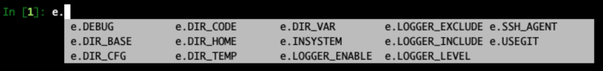
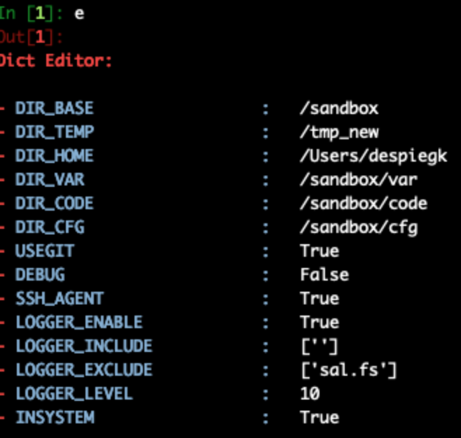
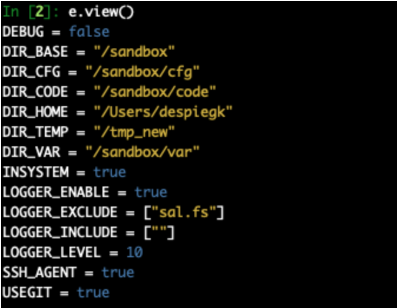
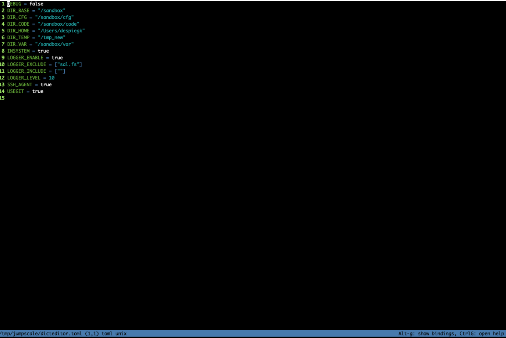

## dict editor

for the source of this info go to:
- https://github.com/threefoldtech/jumpscaleX/tree/master/Jumpscale/data/dicteditor

is a convenient tool to manipulate a dict, is used to manage the jumpscale main config file. Is also part of each jsconfig class (which has data inside).

### basic usage

```python

def test(self):
    """
    js_shell 'j.data.dict_editor.test()'
    :return:
    """
    import copy
    config = copy.copy(j.core.myenv.config) #to make sure we don't edit the jumpscale config file

    e=j.data.dict_editor.get(config)

    e.DIR_TEMP="/tmp_new"

    assert config["DIR_TEMP"]=="/tmp_new"


```

tab completion works for the editor, can change properties right away



### when looking at the editor

you get a nicely formatted output.



### can also use the view function




### can also use the edit function



will use editor micro, make sure its installed. After editing the file the data will be put back in the dict.

### usage as part of the jsconfig class

works for each data object which is result of using the jumpscale schema framework.

```python
schema = """
@url = despiegk.test2
llist2 = "" (LS)
nr = 4
date_start = 0 (D)
description = ""
cost_estimate = 0.0 #this is a comment
llist = []
enum = "red,green,blue" (E) #first one specified is the default one

@url = despiegk.test3
llist = []
description = ""
"""
s=j.data.schema.get(schema_text=schema)
o=s.new()
```

you can now use the o.edit() and o.view() methods.

They use the dict editor underneith.

