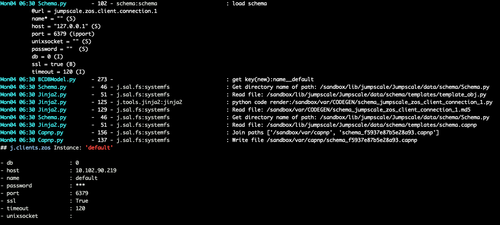

## Logging

### how to call

#### if class inherits from JSBASE (should be all classes we work on)

```
self._log_debug('List files in directory with path: %s' % path,data=...,_levelup=3)
```



```python
def _print(self,msg,cat=""):
    self._log(msg,cat=cat,level=15)

def _log_debug(self,msg,cat="",data=None,_levelup=1):
    self._log(msg,cat=cat,level=10,data=data,_levelup=_levelup)

def _log_info(self,msg,cat="",data=None,_levelup=1):
    self._log(msg,cat=cat,level=20,data=data,_levelup=_levelup)

def _log_warning(self,msg,cat="",data=None,_levelup=1):
    self._log(msg,cat=cat,level=30,data=data,_levelup=_levelup)

def _log_error(self,msg,cat="",data=None,_levelup=1):
    self._log(msg,cat=cat,level=40,data=data,_levelup=_levelup)

def _log_critical(self,msg,cat="",data=None,_levelup=1):
    self._log(msg,cat=cat,level=50,data=data,_levelup=_levelup)

def _log(self,msg,cat="",level=10,data=None,context="",_levelup=1):
    """

    :param msg: what you want to log
    :param cat: any dot notation category
    :param level: level of the log
    :return:

    can use {RED}, {RESET}, ... see color codes

    levels:

    - CRITICAL 	50
    - ERROR 	40
    - WARNING 	30
    - INFO 	    20
    - STDOUT 	15
    - DEBUG 	10

    """
```

#### data

- will be stored in logging aggregator (redis)
- if std out gets nicely print to stdout
- if data is dict it will be formatted yaml (fall back to json) when printing to screen
- if dict: 'passwd', 'secret', 'password' are converted to '***' to not show sensitive info

#### _levelup argument

note the _levelup argument, allows you to choose a source of code levels up, very handy for JS supporting classes. Deffault is 1.

E.g. in SystemFS we use _levelup = 3, this will show the caller of the systemfs function rather then systemfs itself. Can see in picture above.


#### if in installer or no JSBASE class

```python
j.core.tools.log("mylog",cat="cat",level=10)
j.core.tools.log("mylog",cat="cat",level=15)
j.core.tools.log("mylog",cat="cat",level=20)
j.core.tools.log("mylog",cat="cat",level=30)
j.core.tools.log("mylog",cat="cat",level=40)
j.core.tools.log("mylog",cat="cat",level=50)
```

### LOGGING LEVELS:

- CRITICAL 	50
- ERROR 	40
- WARNING 	30
- INFO 	    20
- STDOUT 	15
- DEBUG 	10
- NOTSET 	0


## logging configuration

```toml
#if debug on then will log all
DEBUG = true

LOGGER_INCLUDE = ['*']
LOGGER_EXCLUDE = ['sal.fs']
LOGGER_LEVEL = 15
# if false then will not show on console (also not in debug)
LOGGER_CONSOLE = false 
# will log to redis server
LOGGER_REDIS = true
```

see /sandbox/cfg/jumpscale_config.toml

### log impl details

### dict keys:

- processid : a string id can be a pid or any other identification of the log
- cat   : optional category for log
- level : levels see https://docs.python.org/3/library/logging.html#levels
- linenr : nr in file where log comes from
- filepath : path where the log comes from
- context : where did the message come from e.g. def name
- message : content of the message
- data : additional data e.g. stacktrace, depending context can be different
- hash: optional, 16-32 bytes unique for this message normally e.g. md5 of eg. concatenation of important fields


## how to call logging on class

```
self._log_debug('List files in directory with path: %s' % path,_levelup=3)
```


when logging to redis server, consult using

```
j.clients.logger.tail()
```

will show everything going on

### how to log everything (debug mode)

```j.tools.logger.debug=True```

This will make sure that all logging functions are enabled on all objects in jumpscale, easy for debugging
Will also make sure redis is running for core functions

This will put full jumpscale in a debug mode.

### redis

if there is a core redis then all logging will also happen to redis if 'LOGGER_REDIS' in config file set.
Max 2000 logentries are kept per process.

#### to listen to logs going to redis

#### how are logs stored in redis

- hset: log:$log_id:$log_prefix log_id thedata, which is msgpack

### logger prefix (FIX)

on classes who inherit from our jsbase class you can use self._logger_prefix
this prefix will then be  used for all log statements, this makes it easy to search for logs later

if not filled in then the prefix will be self._location which will give good idea where log comes from


