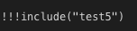

# macro's

## how to call the macro

can put the macro in code block or without




there should be no language specified on the ``` line

when there are many arguments then there is also a multiline one

```python
!!!include
link = "https://github.com/threefoldtech/jumpscaleX/tree/master/Jumpscale/tools/fixer/Fixer.py"
doc_only = "True"
```

the arguments need to be a dict in toml format

in this case the include macro will be called with the 2 arguments specified: link and doc_only


